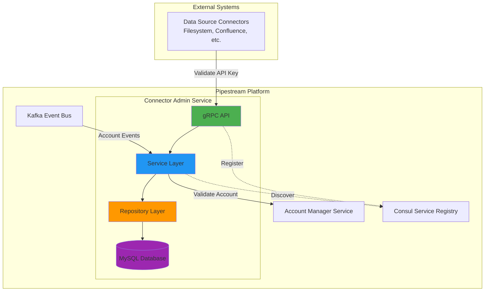
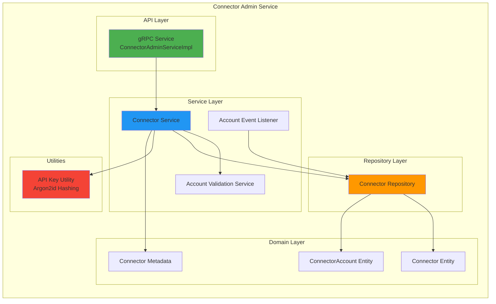
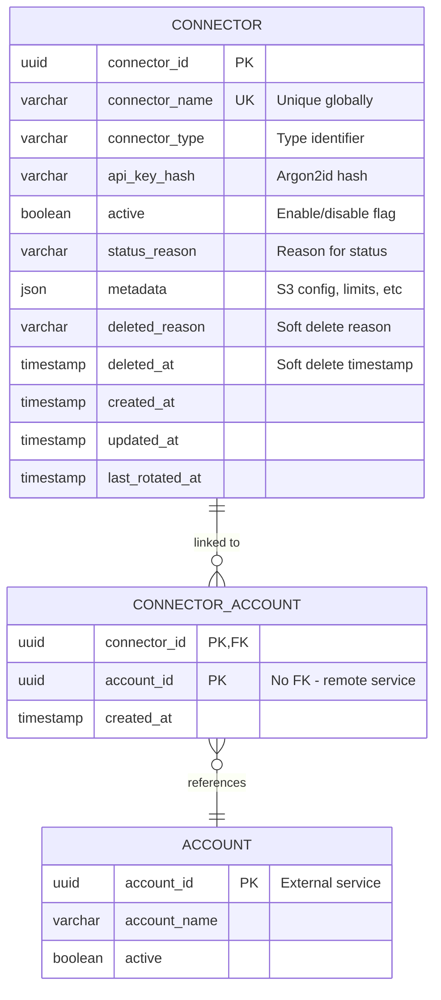
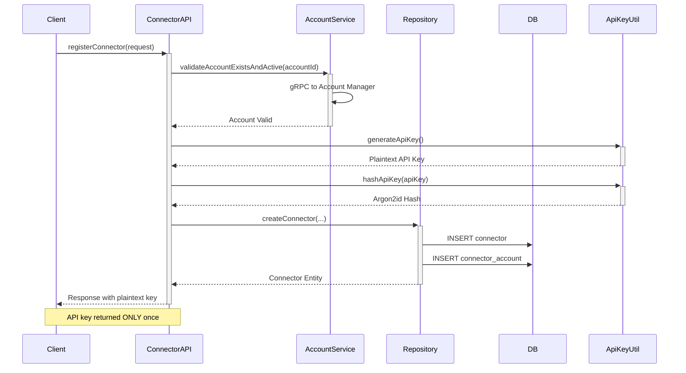
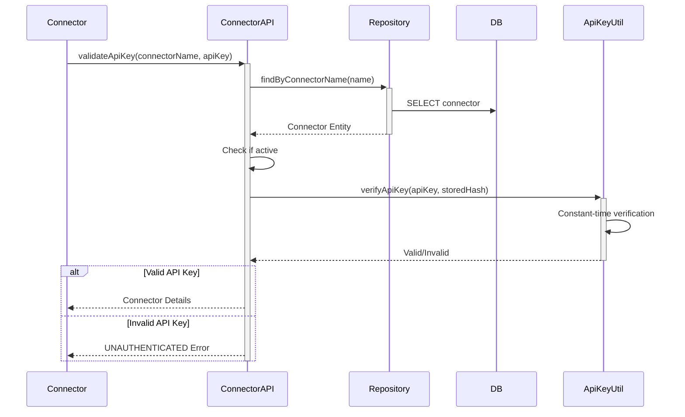
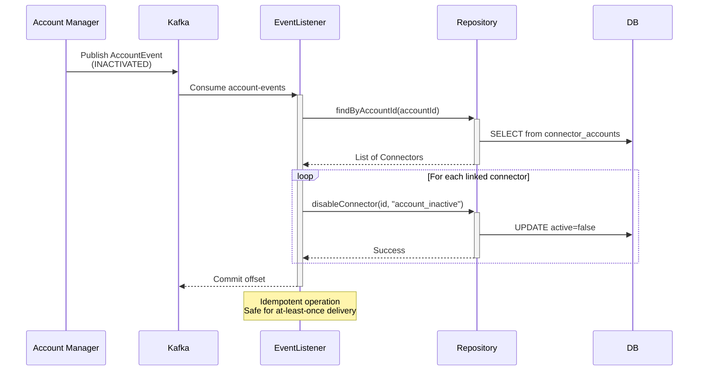

# Connector Admin Service

A microservice within the **Pipestream AI platform** that manages external data source connectors for document ingestion. This service handles connector lifecycle management, API key generation and validation, account linking, and reactive synchronization with account lifecycle events.

[](https://github.com/ai-pipestream/connector-admin/actions)

## Table of Contents

- [Overview](#overview)
- [Architecture](#architecture)
  - [System Context](#system-context)
  - [Component Architecture](#component-architecture)
  - [Data Model](#data-model)
  - [API Flow](#api-flow)
- [Features](#features)
- [Technology Stack](#technology-stack)
- [Getting Started](#getting-started)
  - [Prerequisites](#prerequisites)
  - [Local Development](#local-development)
  - [Running Tests](#running-tests)
- [API Documentation](#api-documentation)
- [Security](#security)
- [Configuration](#configuration)
- [Deployment](#deployment)
- [Downstream Enhancements](#downstream-enhancements)
- [Contributing](#contributing)
- [License](#license)

## Overview

The Connector Admin Service is responsible for:

- **Connector Registration**: Creating and configuring external data source connectors
- **API Key Management**: Generating, hashing, rotating, and validating API keys using Argon2id
- **Account Linking**: Managing many-to-many relationships between connectors and accounts
- **Lifecycle Management**: Enabling, disabling, and soft-deleting connectors
- **Event-Driven Synchronization**: Reacting to account lifecycle events via Kafka to maintain consistency
- **Secure Authentication**: Providing validation endpoints for connector authentication

### Key Characteristics

- **Reactive Architecture**: Built on Quarkus with reactive programming using Mutiny
- **Service Decoupling**: No direct database dependencies on other services; uses gRPC for cross-service communication
- **Security First**: Implements OWASP-recommended Argon2id password hashing with constant-time verification
- **Event-Driven**: Kafka consumers automatically synchronize connector status with account lifecycle
- **Cloud-Native**: Designed for containerized deployment with service discovery via Consul

## Architecture

### System Context



### Component Architecture



### Data Model



### API Flow

#### Connector Registration Flow



#### API Key Validation Flow



#### Account Lifecycle Event Flow



## Features

### Core Capabilities

- **Connector Management**
  - Register new connectors with unique names
  - Update connector properties (name, metadata)
  - Soft delete with audit trail
  - List connectors with filtering and pagination

- **API Key Security**
  - Generate cryptographically secure 256-bit API keys
  - Hash with Argon2id (OWASP recommended, 64MB memory, 3 iterations)
  - Constant-time verification to prevent timing attacks
  - Key rotation with single-time plaintext return

- **Account Integration**
  - Link connectors to multiple accounts (many-to-many)
  - Validate account existence via gRPC
  - No direct database coupling with account service

- **Status Management**
  - Enable/disable connectors with reason tracking
  - Automatic status synchronization with account lifecycle
  - Status reasons: `account_inactive`, manual operations, etc.

- **Event-Driven Architecture**
  - Kafka consumer for account lifecycle events
  - Automatic connector disabling when accounts are inactivated
  - Automatic connector reactivation when accounts are reactivated

### Metadata Support

Connectors store flexible JSON metadata including:
- S3 bucket and base path for document storage
- Max file size limits
- Rate limiting configuration (requests per minute)
- Default metadata key-value pairs applied to all documents

## Technology Stack

| Category | Technology | Version |
|----------|-----------|---------|
| **Language** | Java (Temurin) | 21 |
| **Framework** | Quarkus | 3.x |
| **Build Tool** | Gradle | 8.x |
| **Database** | MySQL | 8.x |
| **ORM** | Hibernate Panache | - |
| **Migrations** | Flyway | - |
| **Messaging** | Apache Kafka | - |
| **Schema Registry** | Apicurio | - |
| **Protocol** | gRPC + Protocol Buffers | - |
| **Service Discovery** | Consul + Stork | - |
| **Security** | Argon2id (password4j) | - |
| **Reactive** | SmallRye Mutiny | - |
| **Testing** | JUnit 5, WireMock | - |

## Getting Started

### Prerequisites

- **Java 21** (Temurin distribution recommended)
- **Docker** and **Docker Compose** (for DevServices)
- **Gradle** (or use included wrapper)
- **Git**

### Local Development

1. **Clone the repository**

```bash
git clone https://github.com/ai-pipestream/connector-admin.git
cd connector-admin
```

2. **Start the service** (includes all dependencies via DevServices)

```bash
./scripts/start-connector-admin.sh
```

This script will:
- Validate prerequisites
- Start Quarkus in dev mode
- Automatically provision MySQL, Kafka, Consul, and Schema Registry via DevServices
- Run Flyway migrations
- Register service with Consul
- Expose gRPC/HTTP on port `38107`

3. **Verify the service is running**

```bash
# Health check
curl http://localhost:38107/q/health

# OpenAPI documentation
curl http://localhost:38107/q/openapi

# Dev UI (Quarkus)
open http://localhost:38107/q/dev
```

### Running Tests

```bash
# Run all tests
./gradlew test

# Run specific test class
./gradlew test --tests ConnectorAdminServiceTest

# Run with coverage
./gradlew test jacocoTestReport
```

### Building

```bash
# Build JAR
./gradlew build

# Build Docker image
./gradlew build -Dquarkus.container-image.build=true

# Build native image (requires GraalVM)
./gradlew build -Dquarkus.native.enabled=true
```

## API Documentation

### gRPC Service Definition

The service implements the `ConnectorAdmin` gRPC service defined in the `pipestream-grpc-stubs` library.

#### Key Operations

| RPC Method | Description | Auth Required |
|------------|-------------|---------------|
| `RegisterConnector` | Create new connector and generate API key | Yes |
| `GetConnector` | Retrieve connector details by ID | Yes |
| `ValidateApiKey` | Authenticate connector by name and API key | No |
| `ListConnectors` | List connectors with filters and pagination | Yes |
| `SetConnectorStatus` | Enable or disable a connector | Yes |
| `DeleteConnector` | Soft delete a connector | Yes |
| `RotateApiKey` | Generate new API key for connector | Yes |
| `UpdateConnector` | Update connector name and metadata | Yes |

### Example: Register Connector

**Request**
```protobuf
message RegisterConnectorRequest {
  string account_id = 1;
  string connector_name = 2;
  string connector_type = 3;
  ConnectorMetadata metadata = 4;
}
```

**Response**
```protobuf
message RegisterConnectorResponse {
  string connector_id = 1;
  string api_key = 2;  // RETURNED ONLY ONCE
  Connector connector = 3;
}
```

**Usage**
```java
ConnectorAdminClient client = // ... get client
RegisterConnectorRequest request = RegisterConnectorRequest.newBuilder()
    .setAccountId("account-uuid")
    .setConnectorName("my-confluence-connector")
    .setConnectorType("confluence")
    .setMetadata(ConnectorMetadata.newBuilder()
        .setS3Bucket("pipestream-docs")
        .setS3BasePath("connectors/confluence")
        .setMaxFileSize(52428800)  // 50MB
        .setRateLimitPerMinute(60)
        .build())
    .build();

RegisterConnectorResponse response = client.registerConnector(request).await().indefinitely();
String apiKey = response.getApiKey();  // Store this securely!
```

### Pagination

The `ListConnectors` API uses offset-based pagination:

```protobuf
message ListConnectorsRequest {
  optional string account_id = 1;  // Filter by account
  optional bool active_only = 2;   // Filter by active status
  int32 page_size = 3;             // Default: 50, Max: 100
  string page_token = 4;           // Opaque offset token
}

message ListConnectorsResponse {
  repeated Connector connectors = 1;
  string next_page_token = 2;
  int64 total_count = 3;
}
```

## Security

### API Key Security Model

1. **Generation**: 256-bit cryptographically secure random values (Base64 URL-encoded)
2. **Storage**: Only Argon2id hashes stored in database (never plaintext)
3. **Verification**: Constant-time comparison to prevent timing attacks
4. **Rotation**: New key generated, old key immediately invalidated
5. **Single Exposure**: Plaintext key returned only once at creation/rotation

### Argon2id Parameters

```java
// Configured for security in 2024
Memory Cost:    64 MB
Iterations:     3
Parallelism:    4 threads
Algorithm:      Argon2id (hybrid mode - optimal for password hashing)
```

These parameters follow OWASP recommendations and balance security with performance.

### Security Best Practices

- API keys should be treated like passwords
- Store keys in secure secret management systems (e.g., HashiCorp Vault, AWS Secrets Manager)
- Rotate keys regularly
- Monitor failed validation attempts
- Use TLS for all gRPC communication in production

## Configuration

### Application Properties

Key configuration properties (see `application.properties`):

```properties
# Service
quarkus.http.port=38107
quarkus.application.name=connector-admin

# Database
quarkus.datasource.jdbc.url=jdbc:mysql://localhost:3306/pipeline_connector_dev
quarkus.datasource.username=pipeline_user
quarkus.datasource.password=pipeline_password

# Flyway Migrations
quarkus.flyway.migrate-at-start=true

# Kafka
kafka.bootstrap.servers=localhost:9094
mp.messaging.incoming.account-events.topic=account-events
mp.messaging.incoming.account-events.group.id=connector-admin

# gRPC
quarkus.grpc.server.use-separate-server=false

# Service Discovery
quarkus.stork.account-manager.service-discovery=consul
quarkus.consul.host=localhost
quarkus.consul.port=8500
```

### Environment-Specific Configuration

- **Development**: `application.properties` (with DevServices)
- **Test**: `application-test.properties` (with test containers)
- **Production**: Override via environment variables or ConfigMaps

```bash
# Example production override
export QUARKUS_DATASOURCE_JDBC_URL="jdbc:mysql://mysql-prod:3306/connector_admin"
export KAFKA_BOOTSTRAP_SERVERS="kafka-1:9092,kafka-2:9092,kafka-3:9092"
```

## Deployment

### Docker

Build and run the service in a container:

```bash
# Build container image
./gradlew build -Dquarkus.container-image.build=true

# Run container
docker run -p 38107:38107 \
  -e QUARKUS_DATASOURCE_JDBC_URL=jdbc:mysql://host.docker.internal:3306/connector_admin \
  -e KAFKA_BOOTSTRAP_SERVERS=host.docker.internal:9094 \
  ghcr.io/ai-pipestream/connector-admin:latest
```

### Kubernetes

Example deployment manifest:

```yaml
apiVersion: apps/v1
kind: Deployment
metadata:
  name: connector-admin
spec:
  replicas: 3
  selector:
    matchLabels:
      app: connector-admin
  template:
    metadata:
      labels:
        app: connector-admin
    spec:
      containers:
      - name: connector-admin
        image: ghcr.io/ai-pipestream/connector-admin:latest
        ports:
        - containerPort: 38107
          name: grpc-http
        env:
        - name: QUARKUS_DATASOURCE_JDBC_URL
          valueFrom:
            secretKeyRef:
              name: connector-admin-secrets
              key: db-url
        - name: KAFKA_BOOTSTRAP_SERVERS
          value: kafka-service:9092
        livenessProbe:
          httpGet:
            path: /q/health/live
            port: 38107
        readinessProbe:
          httpGet:
            path: /q/health/ready
            port: 38107
        resources:
          requests:
            memory: "512Mi"
            cpu: "500m"
          limits:
            memory: "1Gi"
            cpu: "1000m"
```

### CI/CD Pipeline

The service includes a GitHub Actions workflow (`.github/workflows/build-and-publish.yml`) that:

1. Builds and tests on every push
2. Publishes artifacts to GitHub Packages (main branch)
3. Builds and pushes Docker images to ghcr.io
4. Tags images with commit SHA and `latest`

## Downstream Enhancements

### High Priority

#### 1. **API Key Grace Period for Rotation**

**Problem**: Current implementation immediately invalidates old API key on rotation, causing downtime.

**Solution**: Implement grace period allowing both old and new keys to work.

```java
// Proposed schema change
ALTER TABLE connectors ADD COLUMN previous_api_key_hash VARCHAR(255);
ALTER TABLE connectors ADD COLUMN previous_key_expires_at TIMESTAMP;

// Logic
- Store old hash in previous_api_key_hash with expiration timestamp
- validateApiKey() checks both current and previous hash
- Background job purges expired previous keys
```

**Impact**: Zero-downtime key rotation for production connectors

#### 2. **Hard Delete Implementation**

**Problem**: Soft deletes accumulate, unique constraints on `connector_name` prevent reuse.

**Solution**: Implement asynchronous hard delete with crawl session cleanup.

```java
// Add to ConnectorAdminService
public Uni<Void> hardDeleteConnector(String connectorId) {
    return crawlSessionClient.deleteByConnector(connectorId)
        .flatMap(v -> documentClient.deleteByConnector(connectorId))
        .flatMap(v -> connectorRepository.hardDelete(connectorId));
}
```

**Considerations**:
- Cascade delete crawl sessions and documents
- Implement as async job (may take time for large connectors)
- Add API for checking delete job status

#### 3. **Rate Limiting Enforcement**

**Problem**: Rate limit stored in metadata but not enforced.

**Solution**: Implement rate limiting middleware for connector API calls.

```java
// Use Quarkus Rate Limiting or Redis-based solution
@RateLimited(bucket = "connector:{connectorId}",
             rate = "connector.metadata.rateLimitPerMinute")
public Uni<IngestDocumentResponse> ingestDocument(IngestDocumentRequest request)
```

**Benefits**: Protect platform from aggressive connectors

#### 4. **Audit Logging**

**Problem**: No audit trail for connector operations (who did what when).

**Solution**: Implement audit event logging to Kafka.

```java
// Publish audit events
ConnectorAuditEvent.newBuilder()
    .setEventType("CONNECTOR_REGISTERED")
    .setConnectorId(connectorId)
    .setActorId(accountId)
    .setTimestamp(Instant.now())
    .setMetadata(Map.of("connector_name", name))
    .build();
```

**Use Cases**: Security investigations, compliance, debugging

### Medium Priority

#### 5. **Connector Type Validation**

**Problem**: `connector_type` is free-form string, no validation.

**Solution**: Add enum validation for supported connector types.

```protobuf
enum ConnectorType {
  CONNECTOR_TYPE_UNSPECIFIED = 0;
  CONNECTOR_TYPE_FILESYSTEM = 1;
  CONNECTOR_TYPE_CONFLUENCE = 2;
  CONNECTOR_TYPE_SHAREPOINT = 3;
  CONNECTOR_TYPE_GOOGLE_DRIVE = 4;
  CONNECTOR_TYPE_DATABASE = 5;
}
```

**Benefits**: Type safety, prevents typos, enables type-specific logic

#### 6. **Connector Health Checks**

**Problem**: No visibility into connector health (last seen, error states).

**Solution**: Add health tracking fields and periodic heartbeat.

```sql
ALTER TABLE connectors ADD COLUMN last_seen_at TIMESTAMP;
ALTER TABLE connectors ADD COLUMN health_status VARCHAR(50);
ALTER TABLE connectors ADD COLUMN last_error TEXT;
```

**API**:
```protobuf
rpc SendHeartbeat(HeartbeatRequest) returns (HeartbeatResponse);
rpc GetConnectorHealth(GetConnectorHealthRequest) returns (ConnectorHealth);
```

#### 7. **Bulk Operations**

**Problem**: No efficient way to operate on multiple connectors.

**Solution**: Add bulk APIs for common operations.

```protobuf
rpc BulkSetConnectorStatus(BulkSetConnectorStatusRequest) returns (BulkSetConnectorStatusResponse);
rpc BulkDeleteConnectors(BulkDeleteConnectorsRequest) returns (BulkDeleteConnectorsResponse);
```

**Use Cases**: Admin operations, account cleanup, testing

#### 8. **Connector Usage Metrics**

**Problem**: No visibility into connector usage patterns.

**Solution**: Track and expose metrics.

```java
// Add Micrometer metrics
@Counted(name = "connector.api.calls", description = "API calls per connector")
@Timed(name = "connector.api.duration", description = "API call duration")
public Uni<ValidateApiKeyResponse> validateApiKey(...)
```

**Metrics to Track**:
- API calls per connector
- Failed authentication attempts
- Documents ingested per connector
- Average request latency

### Future Enhancements

#### 9. **Multi-Region Support**

Add region awareness for data residency requirements.

```sql
ALTER TABLE connectors ADD COLUMN region VARCHAR(50);
```

#### 10. **Webhook Notifications**

Allow accounts to register webhooks for connector events (status changes, errors, etc.).

#### 11. **Connector Templates**

Pre-configured templates for common connector types to simplify setup.

#### 12. **API Key Scoping**

Support for fine-grained permissions per API key (read-only, write-only, admin).

#### 13. **Connector Quotas**

Enforce limits on number of connectors per account tier.

#### 14. **GraphQL API**

Add GraphQL endpoint alongside gRPC for web/mobile clients.

## Contributing

### Development Workflow

1. Fork the repository
2. Create a feature branch (`git checkout -b feature/my-feature`)
3. Make your changes
4. Run tests (`./gradlew test`)
5. Commit with conventional commits (`git commit -m "feat: add bulk operations"`)
6. Push to your fork
7. Open a Pull Request

### Code Standards

- **Java Style**: Follow Google Java Style Guide
- **Testing**: Maintain >80% code coverage
- **Documentation**: Update JavaDocs and README for public APIs
- **Commits**: Use [Conventional Commits](https://www.conventionalcommits.org/)

### Running Quality Checks

```bash
# Run tests
./gradlew test

# Check code formatting
./gradlew spotlessCheck

# Apply code formatting
./gradlew spotlessApply

# Generate coverage report
./gradlew jacocoTestReport
```

## License

Copyright 2024 Pipestream AI

Licensed under the Apache License, Version 2.0. See [LICENSE](LICENSE) for details.

---

## Support

For issues, questions, or contributions:

- **Issues**: [GitHub Issues](https://github.com/ai-pipestream/connector-admin/issues)
- **Documentation**: [Pipestream Docs](https://docs.pipestream.ai)
- **Community**: [Pipestream Discord](https://discord.gg/pipestream)

---

**Built with ❤️ by the Pipestream AI Team**
