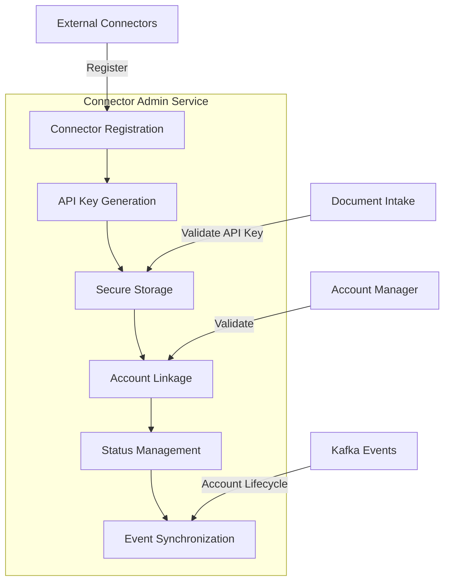
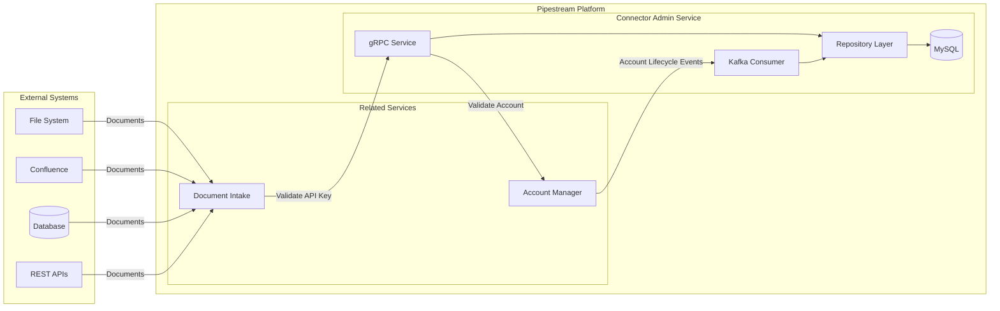
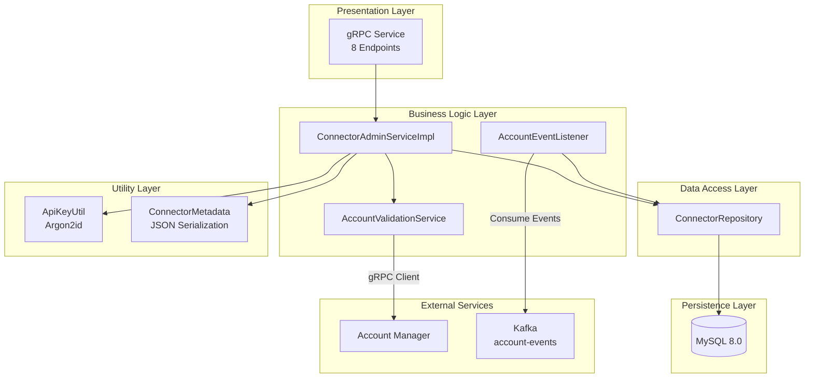
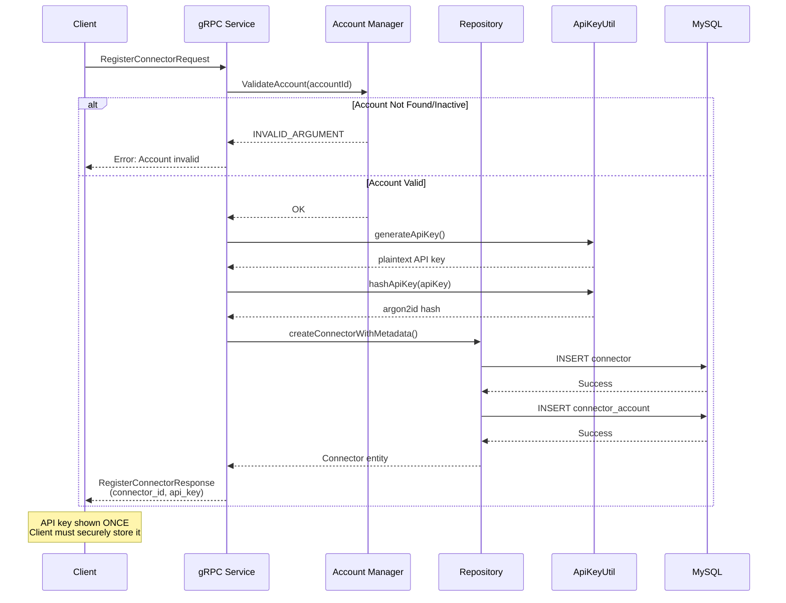
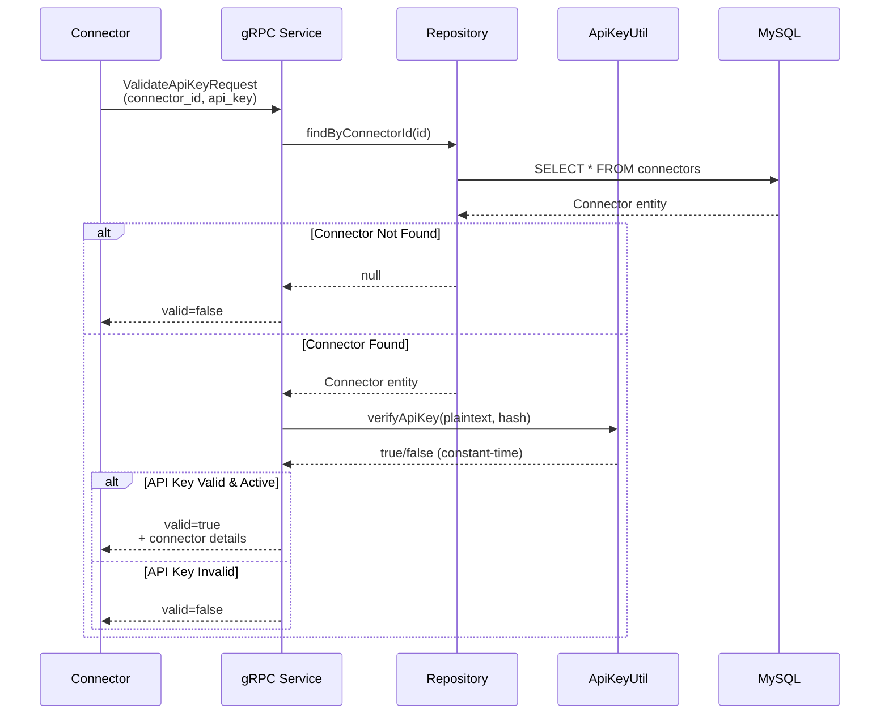
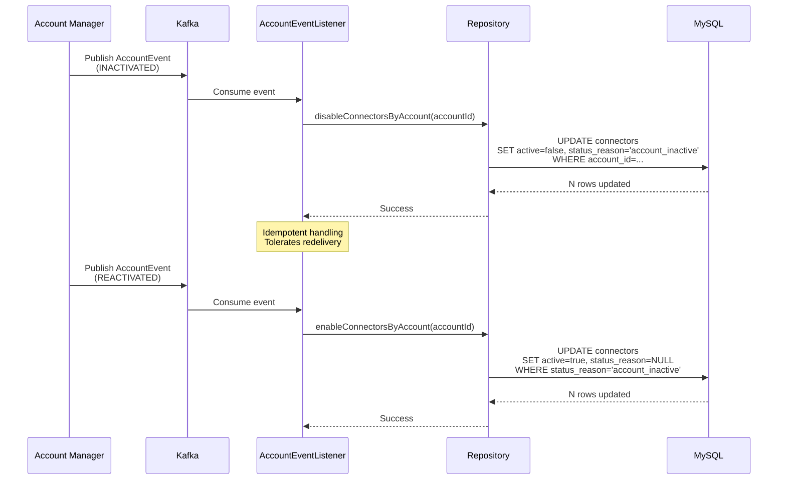
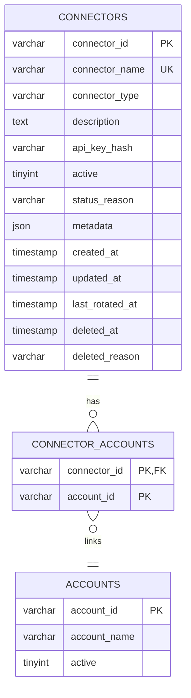
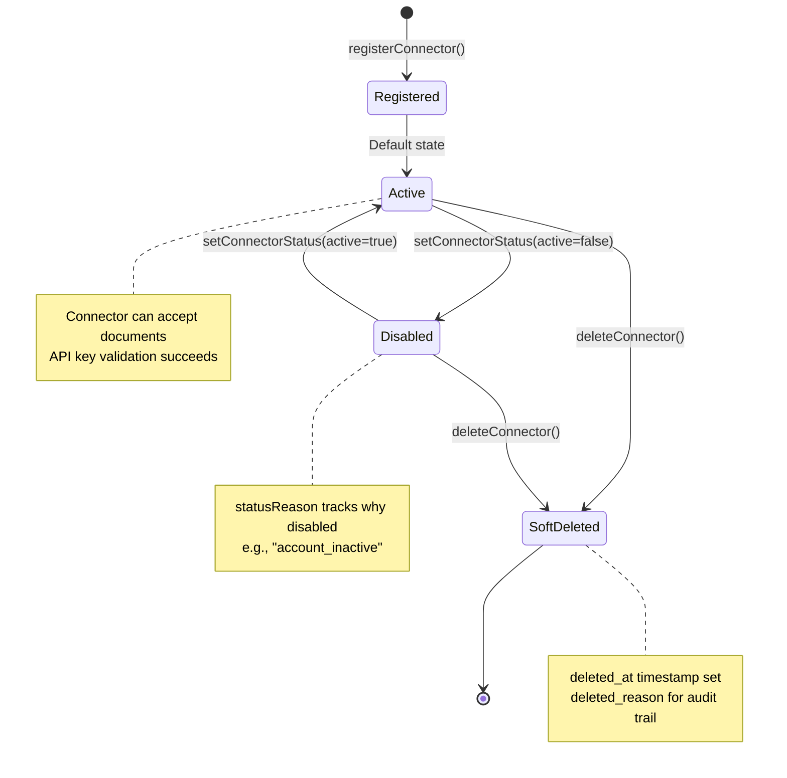
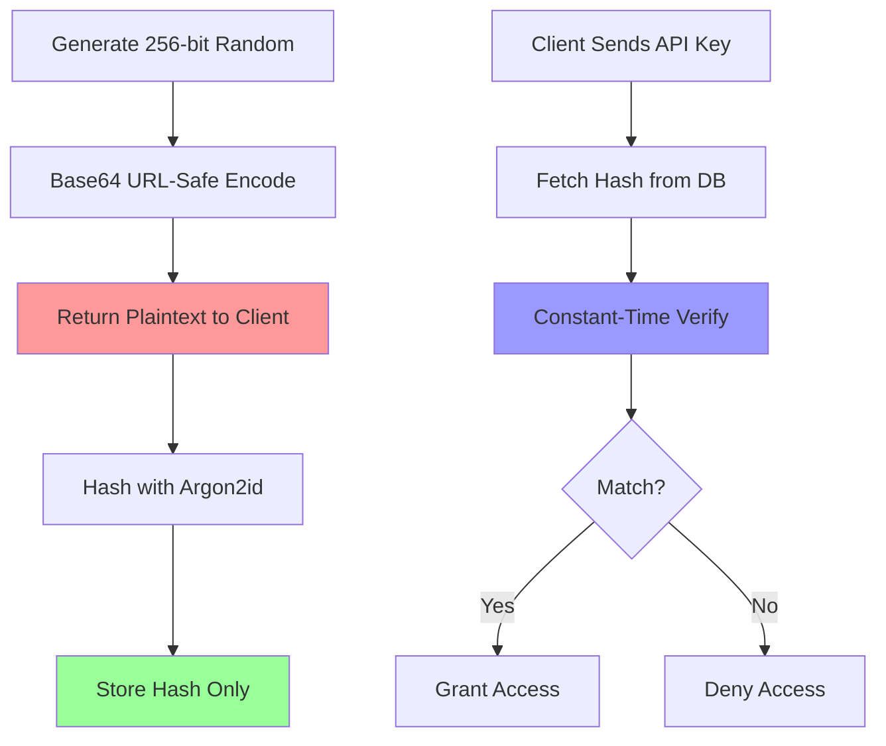

# Connector Admin Service

[](https://github.com/ai-pipestream/connector-admin/actions)
[](https://opensource.org/licenses/MIT)

A high-performance microservice for managing external data source connectors in the Pipestream platform. Provides secure registration, authentication, and lifecycle management for connectors that ingest documents from various sources (filesystems, APIs, databases, SaaS applications).

## 📑 Table of Contents

- [Overview](#overview)
- [Architecture](#architecture)
- [Key Features](#key-features)
- [Technology Stack](#technology-stack)
- [Getting Started](#getting-started)
- [API Reference](#api-reference)
- [Database Schema](#database-schema)
- [Configuration](#configuration)
- [Security](#security)
- [Testing](#testing)
- [Deployment](#deployment)
- [Future Enhancements](#future-enhancements)
- [Contributing](#contributing)
- [License](#license)

## Overview

**Connector Admin Service** is a core component of the Pipestream platform that acts as a centralized registry and administrative hub for external data source connectors. It enables:

- **Secure Connector Registration**: Register new connectors with cryptographically secure API keys
- **API Key Management**: Generate, validate, and rotate API keys using Argon2id hashing
- **Account Integration**: Link connectors to multiple accounts with many-to-many relationships
- **Lifecycle Management**: Enable, disable, and soft-delete connectors with full audit trails
- **Event-Driven Synchronization**: Automatically sync connector status with account lifecycle events
- **Metadata Management**: Store connector-specific configuration (S3 paths, rate limits, default metadata)

### Service Responsibilities



## Architecture

### High-Level System Architecture



### Component Architecture



### Data Flow: Connector Registration



### Data Flow: API Key Validation



### Event-Driven Account Synchronization



### Database Entity Relationships



## Key Features

### 🔐 Secure API Key Management

- **Cryptographically Secure Generation**: 256-bit random keys (Base64 URL-safe encoded)
- **Argon2id Hashing**: OWASP 2024 compliant password hashing
  - Memory Cost: 64 MB
  - Time Cost: 3 iterations
  - Parallelism: 4 threads
- **Constant-Time Verification**: Protection against timing attacks
- **One-Time Display**: API keys shown only at creation/rotation
- **Rotation Support**: Generate new keys without downtime

### 🔄 Connector Lifecycle Management



### 🔗 Multi-Account Support

- **Many-to-Many Relationships**: One connector → multiple accounts
- **Junction Table**: `connector_accounts` manages linkages
- **Account Validation**: Real-time validation via account-manager gRPC
- **Cascading Behavior**: Account inactivation → connector disabling

### 📊 Pagination & Filtering

- **Offset-Based Pagination**: Efficient for UI clients
- **Configurable Page Sizes**: Default 50, max 1000
- **Filtering Options**:
  - By account ID
  - Include/exclude inactive connectors
- **Total Count**: For UI pagination controls

### 📦 Flexible Metadata Storage

JSON metadata supports connector-specific configuration:

```json
{
  "s3Bucket": "company-docs-us-east-1",
  "s3BasePath": "connectors/confluence",
  "maxFileSize": 104857600,
  "rateLimitPerMinute": 30,
  "defaultMetadata": {
    "source": "confluence",
    "environment": "production",
    "team": "knowledge-ops"
  }
}
```

### 🎯 Event-Driven Architecture

- **Kafka Integration**: Consume `account-events` topic
- **Automatic Synchronization**: Account lifecycle → connector status
- **Idempotent Handlers**: Safe with at-least-once delivery
- **Event Types Handled**:
  - `INACTIVATED`: Disable all account connectors
  - `REACTIVATED`: Re-enable previously disabled connectors

## Technology Stack

### Core Framework
- **Quarkus 3.x** - Supersonic Subatomic Java framework
- **Java 21** - Latest LTS with virtual threads (Project Loom)
- **GraalVM Native Image** - Ahead-of-time compilation for fast startup

### Service Communication
- **gRPC** (Protocol Buffers v3) - High-performance RPC
- **Apicurio Registry** - Schema versioning and compatibility
- **SmallRye Stork** - Service discovery (Consul integration)

### Data & Persistence
- **Hibernate ORM with Panache** - Simplified JPA
- **Flyway** - Database migration management
- **MySQL 8.0** - ACID-compliant relational database
- **Agroal** - High-performance connection pooling

### Async & Messaging
- **SmallRye Reactive Messaging** - MicroProfile Reactive Messaging
- **Apache Kafka** - Event streaming platform
- **Mutiny** - Intuitive reactive programming library

### Security
- **password4j** - Argon2id password hashing library
- **SecureRandom** - Cryptographically secure random number generation

### DevOps & Infrastructure
- **Docker** - Multi-stage container builds
- **Docker Compose** - Local development services
- **GitHub Actions** - CI/CD pipeline
- **GitHub Packages** - Maven artifact repository
- **GHCR** - Container image registry

## Getting Started

### Prerequisites

- **Java 21** or later
- **Docker** and **Docker Compose**
- **Gradle** (included via wrapper)
- **MySQL 8.0** (or use dev services)

### Local Development Setup

1. **Clone the repository**
   ```bash
   git clone https://github.com/ai-pipestream/connector-admin.git
   cd connector-admin
   ```

2. **Start development services**
   ```bash
   # Ensure you have ~/.pipeline/compose-devservices.yml configured
   # Services: MySQL, Kafka, Apicurio Registry
   docker-compose -f ~/.pipeline/compose-devservices.yml up -d
   ```

3. **Run the application in dev mode**
   ```bash
   ./gradlew quarkusDev
   ```

   Dev mode features:
   - Hot reload on code changes
   - Automatic database migrations
   - gRPC dev UI on http://localhost:8080
   - Health checks on http://localhost:8080/q/health

4. **Run tests**
   ```bash
   ./gradlew test
   ```

### Build Options

**JVM Mode (Fast build)**
```bash
./gradlew build
docker build -f src/main/docker/Dockerfile.jvm -t connector-admin:jvm .
```

**Native Mode (Small footprint)**
```bash
./gradlew build -Dquarkus.package.type=native
docker build -f src/main/docker/Dockerfile.native-micro -t connector-admin:native .
```

### Environment Variables

| Variable | Description | Default |
|----------|-------------|---------|
| `QUARKUS_DATASOURCE_JDBC_URL` | MySQL JDBC URL | `jdbc:mysql://localhost:3306/pipeline_connector_dev` |
| `QUARKUS_DATASOURCE_USERNAME` | Database username | `root` |
| `QUARKUS_DATASOURCE_PASSWORD` | Database password | `password` |
| `KAFKA_BOOTSTRAP_SERVERS` | Kafka brokers | `localhost:9094` |
| `APICURIO_REGISTRY_URL` | Schema registry | `http://localhost:8081` |
| `SERVICE_REGISTRATION_ENABLED` | Enable Consul registration | `false` (dev) |

## API Reference

### gRPC Service

**Service Name**: `connector.intake.v1.ConnectorAdminService`
**Port**: 38107

### Endpoints

#### 1. registerConnector

Register a new connector and generate API key.

**Request**
```protobuf
message RegisterConnectorRequest {
  string connector_name = 1;           // Unique name (e.g., "acme-confluence")
  string connector_type = 2;           // Type (e.g., "confluence", "filesystem")
  string account_id = 3;               // Account to link
  string s3_bucket = 4;                // S3 bucket for documents
  string s3_base_path = 5;             // Base path in S3
  int64 max_file_size = 6;             // Max file size (bytes)
  int64 rate_limit_per_minute = 7;     // Rate limit
  map<string,string> default_metadata = 8;  // Default document metadata
}
```

**Response**
```protobuf
message RegisterConnectorResponse {
  bool success = 1;
  string connector_id = 2;             // UUID of created connector
  string api_key = 3;                  // Plaintext API key (SAVE IT!)
  string message = 4;
}
```

**Errors**
- `INVALID_ARGUMENT`: Account doesn't exist or is inactive
- `ALREADY_EXISTS`: Connector name already registered

#### 2. validateApiKey

Validate connector API key (used by document intake).

**Request**
```protobuf
message ValidateApiKeyRequest {
  string connector_id = 1;
  string api_key = 2;
}
```

**Response**
```protobuf
message ValidateApiKeyResponse {
  bool valid = 1;
  string message = 2;
  ConnectorRegistration connector = 3;  // Only if valid=true
}
```

#### 3. listConnectors

List connectors with pagination and filtering.

**Request**
```protobuf
message ListConnectorsRequest {
  string account_id = 1;               // Optional: filter by account
  bool include_inactive = 2;           // Include disabled connectors
  int32 page_size = 3;                 // Default: 50, Max: 1000
  string page_token = 4;               // Offset token from previous response
}
```

**Response**
```protobuf
message ListConnectorsResponse {
  repeated ConnectorRegistration connectors = 1;
  int32 total_count = 2;
  string next_page_token = 3;          // Empty if no more pages
}
```

#### 4. getConnector

Retrieve connector by ID.

**Request**
```protobuf
message GetConnectorRequest {
  string connector_id = 1;
}
```

**Response**
```protobuf
message GetConnectorResponse {
  ConnectorRegistration connector = 1;
}
```

**Errors**
- `NOT_FOUND`: Connector doesn't exist

#### 5. setConnectorStatus

Enable or disable a connector.

**Request**
```protobuf
message SetConnectorStatusRequest {
  string connector_id = 1;
  bool active = 2;
  string status_reason = 3;            // Optional: reason for status change
}
```

**Response**
```protobuf
message SetConnectorStatusResponse {
  bool success = 1;
  string message = 2;
}
```

#### 6. deleteConnector

Soft delete a connector (preserves audit trail).

**Request**
```protobuf
message DeleteConnectorRequest {
  string connector_id = 1;
  string deleted_reason = 2;           // Required: reason for deletion
}
```

**Response**
```protobuf
message DeleteConnectorResponse {
  bool success = 1;
  string message = 2;
}
```

#### 7. rotateApiKey

Generate a new API key for a connector.

**Request**
```protobuf
message RotateApiKeyRequest {
  string connector_id = 1;
}
```

**Response**
```protobuf
message RotateApiKeyResponse {
  bool success = 1;
  string api_key = 2;                  // New plaintext API key (SAVE IT!)
  string message = 3;
}
```

#### 8. updateConnector

Update connector metadata and name.

**Request**
```protobuf
message UpdateConnectorRequest {
  string connector_id = 1;
  string connector_name = 2;           // Optional: new name
  string s3_bucket = 3;                // Optional: new S3 bucket
  string s3_base_path = 4;             // Optional: new base path
  int64 max_file_size = 5;             // Optional: new max file size
  int64 rate_limit_per_minute = 6;     // Optional: new rate limit
  map<string,string> default_metadata = 7;  // Merged with existing
}
```

**Response**
```protobuf
message UpdateConnectorResponse {
  bool success = 1;
  ConnectorRegistration connector = 2;
  string message = 3;
}
```

## Database Schema

### Tables

#### connectors

Primary table storing connector registrations.

```sql
CREATE TABLE connectors (
  connector_id VARCHAR(255) PRIMARY KEY,
  connector_name VARCHAR(255) UNIQUE NOT NULL,
  connector_type VARCHAR(100) NOT NULL,
  description TEXT,
  api_key_hash VARCHAR(255) NOT NULL,
  active TINYINT(1) DEFAULT 1,
  status_reason VARCHAR(255),
  metadata JSON,
  created_at TIMESTAMP DEFAULT CURRENT_TIMESTAMP,
  updated_at TIMESTAMP DEFAULT CURRENT_TIMESTAMP ON UPDATE CURRENT_TIMESTAMP,
  last_rotated_at TIMESTAMP NULL,
  deleted_at TIMESTAMP NULL,
  deleted_reason VARCHAR(500),

  INDEX idx_connectors_active (active),
  INDEX idx_connectors_name (connector_name),
  INDEX idx_connectors_type (connector_type),
  INDEX idx_connectors_created_at (created_at),
  INDEX idx_connectors_deleted_at (deleted_at)
);
```

#### connector_accounts

Junction table for many-to-many connector-account relationships.

```sql
CREATE TABLE connector_accounts (
  connector_id VARCHAR(255) NOT NULL,
  account_id VARCHAR(255) NOT NULL,
  PRIMARY KEY (connector_id, account_id),
  FOREIGN KEY (connector_id) REFERENCES connectors(connector_id) ON DELETE CASCADE,
  INDEX idx_connector_accounts_account (account_id)
);
```

### Migrations

Managed by **Flyway** with versioned SQL scripts in `src/main/resources/db/migration/`:

- **V1__create_connectors_table.sql** - Initial connectors table
- **V2__create_connector_accounts_table.sql** - M2M junction table
- **V3__add_deletion_tracking.sql** - Soft delete support
- **V4__add_status_reason.sql** - Status tracking

## Configuration

### application.properties

Key configuration sections:

```properties
# gRPC Server (Port 38107)
quarkus.grpc.server.port=38107
quarkus.grpc.server.use-separate-server=false
quarkus.grpc.server.enable-health-service=true
quarkus.grpc.server.enable-reflection-service=true

# Database (MySQL)
quarkus.datasource.db-kind=mysql
quarkus.datasource.jdbc.url=jdbc:mysql://localhost:3306/pipeline_connector_dev
quarkus.datasource.username=root
quarkus.datasource.password=password

# Flyway Migrations
quarkus.flyway.migrate-at-start=true
quarkus.flyway.baseline-on-migrate=true

# Kafka (Reactive Messaging)
kafka.bootstrap.servers=localhost:9094
mp.messaging.incoming.account-events.connector=smallrye-kafka
mp.messaging.incoming.account-events.topic=account-events
mp.messaging.incoming.account-events.value.deserializer=io.apicurio.registry.serde.protobuf.ProtobufKafkaDeserializer

# Service Discovery (Consul)
service.registration.enabled=false  # Enable in prod
service.registration.service-name=connector-admin
service.registration.service-type=APPLICATION
```

### Profiles

- **dev**: Hot reload, dev services, local database
- **test**: Integration tests with Docker Compose
- **prod**: Production settings, service registration

## Security

### API Key Security Model



### Security Best Practices

1. **Never Store Plaintext Keys**
   - API keys are hashed immediately after generation
   - Only the Argon2id hash is stored in the database
   - Plaintext keys shown only once at creation/rotation

2. **Argon2id Configuration**
   - Memory-hard algorithm (64 MB memory cost)
   - Resistant to GPU/ASIC attacks
   - PHC string format for portability

3. **Constant-Time Verification**
   - Prevents timing attacks on key validation
   - Uses `password4j` library's secure comparison

4. **Account Validation**
   - Every registration validates account exists and is active
   - gRPC call to account-manager service
   - Prevents orphaned connectors

5. **Event-Driven Authorization**
   - Account inactivation cascades to connectors
   - Ensures inactive accounts can't ingest documents

## Testing

### Test Coverage

The service includes comprehensive integration tests:

| Test Class | Coverage |
|------------|----------|
| `ConnectorAdminServiceTest` | Full gRPC service integration |
| `ConnectorRepositoryTest` | Database CRUD operations |
| `AccountValidationServiceTest` | gRPC client mocking |
| `ConnectorMetadataTest` | JSON serialization |
| `ConnectorPaginationTest` | Pagination logic |

### Running Tests

```bash
# All tests
./gradlew test

# Specific test
./gradlew test --tests ConnectorAdminServiceTest

# With coverage report
./gradlew test jacocoTestReport
```

### Test Infrastructure

Tests use:
- **QuarkusTest** - Managed test lifecycle
- **Docker Compose** - MySQL, Kafka, Apicurio
- **WireMock gRPC** - Mock account-manager service
- **TestContainers** - Isolated test databases

### Example Test

```java
@QuarkusTest
class ConnectorAdminServiceTest {

    @InjectMock
    AccountValidationService accountValidationService;

    @Test
    void testRegisterConnector_Success() {
        // Mock account validation
        when(accountValidationService.validateAccountExistsAndActive("acc-123"))
            .thenReturn(Uni.createFrom().voidItem());

        // Register connector
        RegisterConnectorRequest request = RegisterConnectorRequest.newBuilder()
            .setConnectorName("test-connector")
            .setConnectorType("filesystem")
            .setAccountId("acc-123")
            .build();

        RegisterConnectorResponse response = connectorAdminService
            .registerConnector(request)
            .await()
            .indefinitely();

        assertTrue(response.getSuccess());
        assertNotNull(response.getConnectorId());
        assertNotNull(response.getApiKey());
    }
}
```

## Deployment

### Docker Deployment

**Build and run JVM image**
```bash
./gradlew build
docker build -f src/main/docker/Dockerfile.jvm -t connector-admin:latest .
docker run -p 38107:38107 \
  -e QUARKUS_DATASOURCE_JDBC_URL=jdbc:mysql://mysql:3306/connectors \
  -e KAFKA_BOOTSTRAP_SERVERS=kafka:9092 \
  connector-admin:latest
```

**Build and run native image**
```bash
./gradlew build -Dquarkus.package.type=native
docker build -f src/main/docker/Dockerfile.native-micro -t connector-admin:native .
docker run -p 38107:38107 connector-admin:native
```

### Kubernetes Deployment

Example deployment manifest:

```yaml
apiVersion: apps/v1
kind: Deployment
metadata:
  name: connector-admin
spec:
  replicas: 3
  selector:
    matchLabels:
      app: connector-admin
  template:
    metadata:
      labels:
        app: connector-admin
    spec:
      containers:
      - name: connector-admin
        image: ghcr.io/ai-pipestream/connector-admin:latest
        ports:
        - containerPort: 38107
          name: grpc
        env:
        - name: QUARKUS_DATASOURCE_JDBC_URL
          valueFrom:
            secretKeyRef:
              name: mysql-credentials
              key: jdbc-url
        - name: KAFKA_BOOTSTRAP_SERVERS
          value: "kafka.default.svc.cluster.local:9092"
        livenessProbe:
          grpc:
            port: 38107
            service: grpc.health.v1.Health
        readinessProbe:
          grpc:
            port: 38107
            service: grpc.health.v1.Health
        resources:
          requests:
            memory: "256Mi"
            cpu: "250m"
          limits:
            memory: "512Mi"
            cpu: "500m"
---
apiVersion: v1
kind: Service
metadata:
  name: connector-admin
spec:
  selector:
    app: connector-admin
  ports:
  - port: 38107
    targetPort: 38107
    name: grpc
```

### CI/CD Pipeline

GitHub Actions workflow:

1. **Build Job**
   - Compile code
   - Run tests
   - Publish to GitHub Packages

2. **Docker Job**
   - Build native image
   - Push to GHCR (only on main branch)
   - Tag with git SHA and semantic version

## Future Enhancements

### Short-Term Improvements

1. **API Key Grace Periods**
   - Allow old key to remain valid during rotation
   - Configurable grace period (e.g., 24 hours)
   - Automatic cleanup after expiration

2. **Cursor-Based Pagination**
   - Replace offset-based with cursor pagination
   - Better performance for large datasets
   - Stable pagination with concurrent updates

3. **Connector Health Checks**
   - Periodic health checks for connectors
   - Track last successful document ingestion
   - Alert on stale connectors

4. **Rate Limiting Enforcement**
   - Implement actual rate limiting (currently stored as metadata)
   - Use token bucket or sliding window algorithms
   - Per-connector and global limits

5. **Metrics & Observability**
   - Prometheus metrics for connector operations
   - OpenTelemetry distributed tracing
   - Grafana dashboards for monitoring

### Medium-Term Enhancements

6. **Connector Templates**
   - Pre-configured templates for common connector types
   - Simplified onboarding for standard sources
   - Template versioning and updates

7. **Webhook Notifications**
   - Notify on connector status changes
   - Failed authentication attempts
   - Rate limit violations

8. **Connector Groups**
   - Organize connectors into logical groups
   - Bulk operations on groups
   - Group-level access controls

9. **Advanced Filtering**
   - Full-text search on connector names/descriptions
   - Filter by creation date, type, status
   - Saved filter presets

10. **Audit Log API**
    - Query audit logs via API
    - Filter by connector, action, timeframe
    - Export audit logs for compliance

### Long-Term Strategic Enhancements

11. **Multi-Region Support**
    - Region-aware connector routing
    - Data residency compliance
    - Regional S3 bucket configuration

12. **Connector Marketplace**
    - Public/private connector sharing
    - Community-contributed connectors
    - Connector ratings and reviews

13. **Advanced Security**
    - OAuth 2.0 support for connectors
    - Certificate-based authentication
    - Hardware security module (HSM) integration

14. **Connector Analytics**
    - Document ingestion trends
    - Performance benchmarks
    - Cost analysis per connector

15. **Multi-Tenancy Isolation**
    - Dedicated connector namespaces
    - Tenant-specific configuration
    - Resource quotas per tenant

16. **GraphQL API**
    - Complementary GraphQL interface
    - Flexible queries for UI clients
    - Real-time subscriptions

17. **Connector SDK**
    - Official SDKs in multiple languages
    - Simplified connector development
    - Testing frameworks

18. **Automated Testing**
    - Integration test suites for connectors
    - Synthetic document ingestion tests
    - Chaos engineering scenarios

### Architecture Improvements

19. **Event Sourcing**
    - Store all state changes as events
    - Complete audit trail
    - Time-travel debugging

20. **CQRS Pattern**
    - Separate read/write models
    - Optimized query performance
    - Event-driven projections

## Contributing

We welcome contributions! Please follow these guidelines:

1. **Fork the repository**
2. **Create a feature branch** (`git checkout -b feature/amazing-feature`)
3. **Commit your changes** (`git commit -m 'Add amazing feature'`)
4. **Push to the branch** (`git push origin feature/amazing-feature`)
5. **Open a Pull Request**

### Code Standards

- Follow Java code conventions
- Write comprehensive tests (>80% coverage)
- Update documentation for new features
- Add Javadocs for public APIs

### Commit Messages

Follow [Conventional Commits](https://www.conventionalcommits.org/):

```
feat: add connector health check endpoint
fix: correct pagination offset calculation
docs: update API reference for validateApiKey
refactor: extract metadata serialization logic
test: add integration tests for event listener
```

## License

This project is licensed under the MIT License - see the [LICENSE](LICENSE) file for details.

```
MIT License

Copyright (c) 2025 ai-pipestream

Permission is hereby granted, free of charge, to any person obtaining a copy
of this software and associated documentation files (the "Software"), to deal
in the Software without restriction, including without limitation the rights
to use, copy, modify, merge, publish, distribute, sublicense, and/or sell
copies of the Software, and to permit persons to whom the Software is
furnished to do so, subject to the following conditions:

The above copyright notice and this permission notice shall be included in all
copies or substantial portions of the Software.

THE SOFTWARE IS PROVIDED "AS IS", WITHOUT WARRANTY OF ANY KIND, EXPRESS OR
IMPLIED, INCLUDING BUT NOT LIMITED TO THE WARRANTIES OF MERCHANTABILITY,
FITNESS FOR A PARTICULAR PURPOSE AND NONINFRINGEMENT. IN NO EVENT SHALL THE
AUTHORS OR COPYRIGHT HOLDERS BE LIABLE FOR ANY CLAIM, DAMAGES OR OTHER
LIABILITY, WHETHER IN AN ACTION OF CONTRACT, TORT OR OTHERWISE, ARISING FROM,
OUT OF OR IN CONNECTION WITH THE SOFTWARE OR THE USE OR OTHER DEALINGS IN THE
SOFTWARE.
```

---

## Support

- **Documentation**: [Pipestream Docs](https://docs.pipestream.ai)
- **Issues**: [GitHub Issues](https://github.com/ai-pipestream/connector-admin/issues)
- **Discussions**: [GitHub Discussions](https://github.com/ai-pipestream/connector-admin/discussions)

---

**Built with ❤️ by the Pipestream Team**
