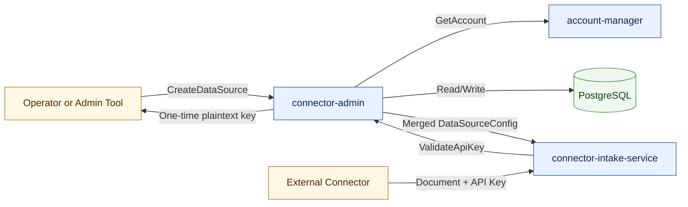
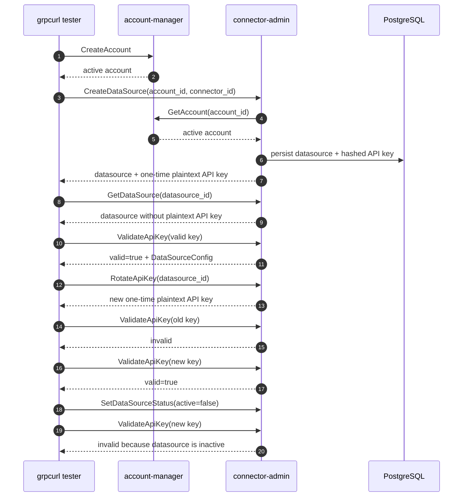
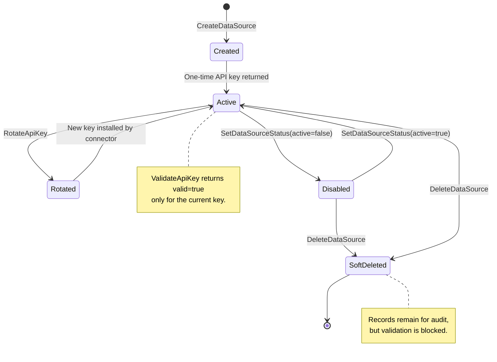
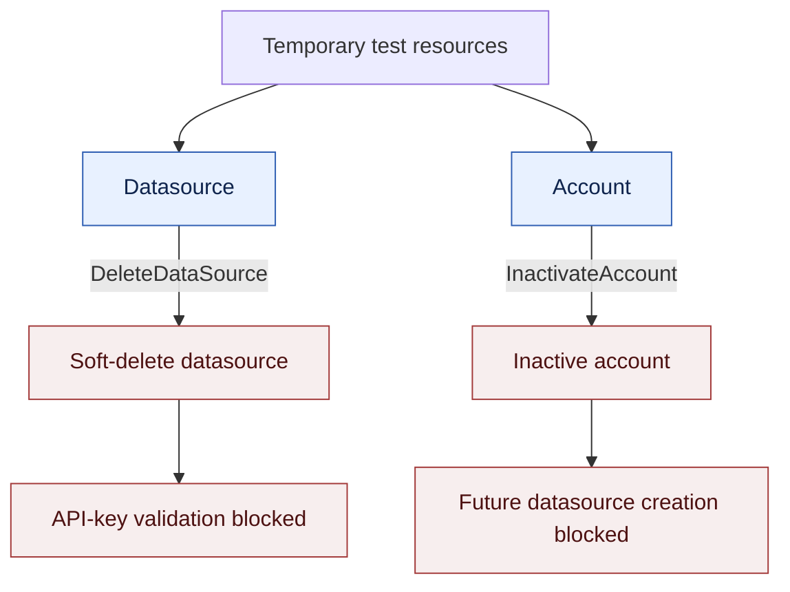

# Connector Admin Client Validation Report

## Executive Summary

Connector Admin was validated as the control point for datasource onboarding and API-key validation. The service starts successfully, exposes the expected gRPC APIs, validates accounts through account-manager, creates datasources with one-time API keys, rotates credentials, blocks invalid or inactive access, and supports operational cleanup through datasource soft-delete.

The validation was performed against live local services:

- `connector-admin` on `localhost:18107`
- `account-manager` on `localhost:18105`
- gRPC reflection enabled on both services

## System Overview



Connector Admin owns the datasource lifecycle and credential authority. Connector Intake calls `ValidateApiKey` before accepting connector traffic, and Connector Admin returns the merged `DataSourceConfig` needed for routing and ingestion policy.

## Validated gRPC Services

Connector Admin exposed:

```text
ai.pipestream.connector.intake.v1.ConnectorRegistrationService
ai.pipestream.connector.intake.v1.DataSourceAdminService
grpc.health.v1.Health
```

Account Manager exposed:

```text
ai.pipestream.repository.account.v1.AccountService
grpc.health.v1.Health
```

Connector Admin health returned:

```json
{
  "status": "SERVING"
}
```

## Live Validation Flow



## Evidence From Live Run

The live run created:

- Account: `grpcurl-test-1778644493`
- Datasource: `464141c0-78b2-323d-aa21-e58a678baf7e`
- Connector type: S3 (`a0eebc99-9c0b-4ef8-bb6d-6bb9bd380a11`)

Key observations:

- Account creation succeeded and returned an active account.
- Datasource creation succeeded and returned a one-time plaintext API key.
- `GetDataSource` did not return the plaintext API key after creation.
- `ValidateApiKey` accepted the current key and returned merged configuration.
- A wrong key was rejected.
- Rotating the key invalidated the old key and returned a new one-time plaintext key.
- Disabling the datasource immediately blocked validation.
- Cleanup soft-deleted the datasource and inactivated the temporary account.

## Credential Lifecycle



## Cleanup Model



Account Manager currently exposes `InactivateAccount`, but not a `DeleteAccount` RPC. Test cleanup therefore inactivates the temporary account and soft-deletes the datasource.

## Repeatable Commands

List Connector Admin services:

```bash
grpcurl -plaintext localhost:18107 list
```

Check health:

```bash
grpcurl -plaintext localhost:18107 grpc.health.v1.Health/Check
```

List connector types:

```bash
grpcurl -plaintext localhost:18107 \
  ai.pipestream.connector.intake.v1.DataSourceAdminService/ListConnectorTypes
```

Run the scripted connector-admin workflow:

```bash
./scripts/upload-document-e2e.sh
```

Run the direct `grpcurl` lifecycle script:

```bash
./scripts/grpcurl-tests.sh
```

## Client-Facing Conclusion

Connector Admin is functioning as the datasource and credential authority. The validated path confirms that datasource creation requires an active account, plaintext API keys are only returned during creation or rotation, invalid and stale keys are rejected, disabled or deleted datasources cannot validate, and cleanup leaves test resources in a non-active state.

