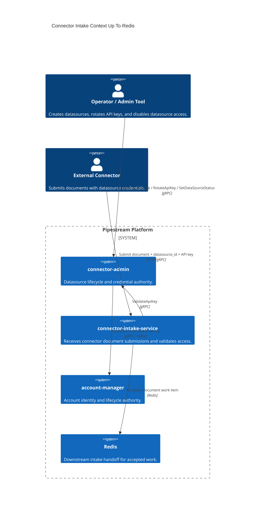
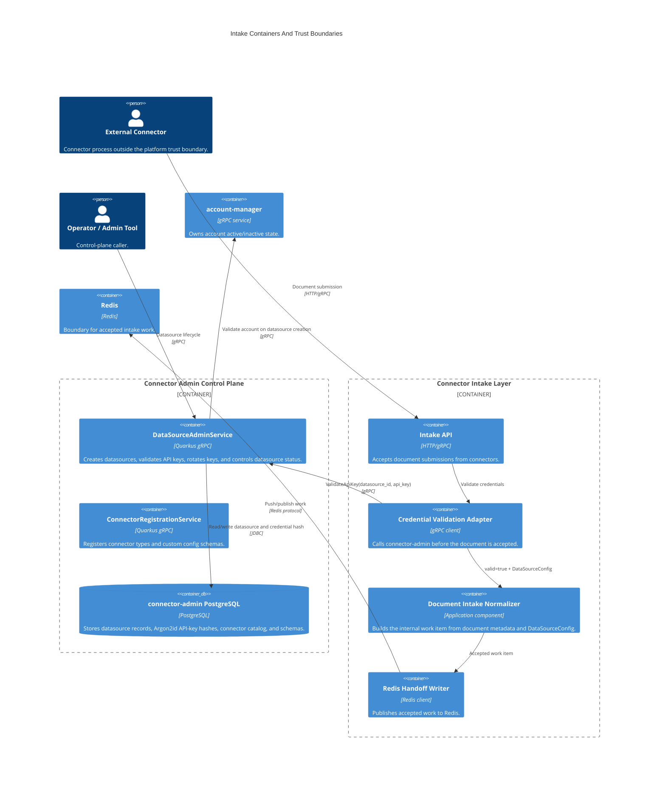
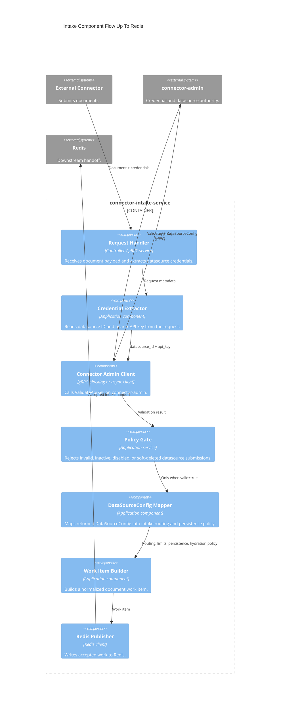
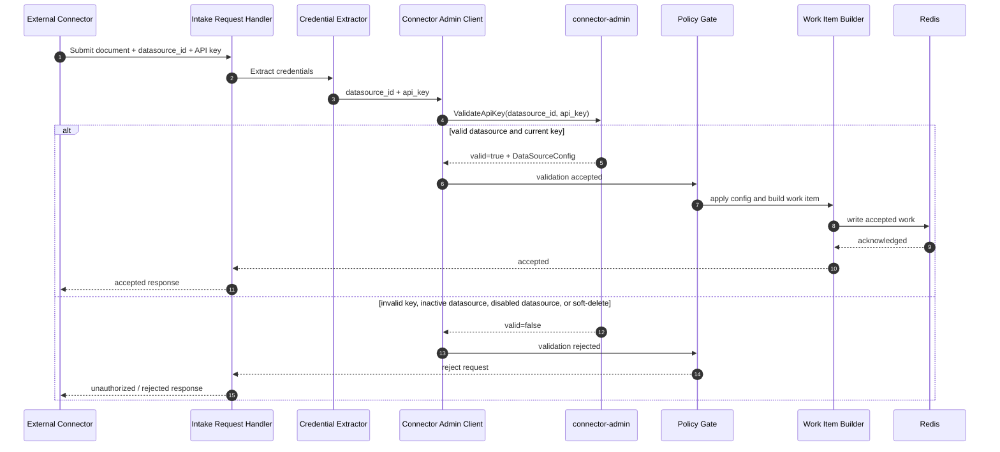

# Intake Layer C4 Diagrams To Redis

This document describes the ingestion path from an external connector through the intake layer up to the Redis handoff. It focuses on the boundary that connector-admin owns or authorizes: datasource credentials, account status, and the `DataSourceConfig` returned to connector-intake before a document can move deeper into the pipeline.

The Redis box below is the downstream queue/cache boundary. This repository does not contain the connector-intake implementation, so the diagrams stop at the handoff rather than documenting Redis consumers that live in other services.

## C4 Level 1: System Context

## C4 Level 2: Containers

## C4 Level 3: Intake Components

## C4 Level 4: Validation Sequence

## Error Handling Expectations

The normal path should be quiet: valid requests authenticate, produce a `DataSourceConfig`, and hand off to Redis. Exceptions should be rare and should represent infrastructure or data integrity failures, not expected business decisions.

Expected business outcomes should stay explicit:

- Invalid API key: return `valid=false`.
- Disabled or soft-deleted datasource: return `valid=false`.
- Missing or inactive account during datasource creation: return `INVALID_ARGUMENT`.
- Missing connector type during datasource creation: return `NOT_FOUND`.

Unexpected runtime failures should be allowed to cross the service boundary where they can be logged once and reported to the caller or messaging layer. connector-admin follows this pattern by catching named gRPC status exceptions first, then `RuntimeException` at the boundary. It should not catch generic `Exception` in transactional paths.

## Redis Handoff Contract

At the Redis boundary, connector-intake should already know:

- The datasource exists and is active.
- The supplied API key matched the current Argon2id hash.
- The account was valid when the datasource was created and account-events can later disable access.
- The work item has the routing data from `DataSourceConfig`, including `drive_name` and merged Tier 1 policy.

Redis should receive only accepted work. Rejected requests should not create Redis entries.
