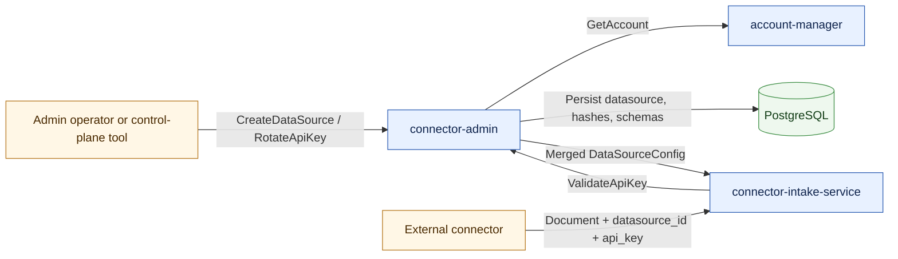
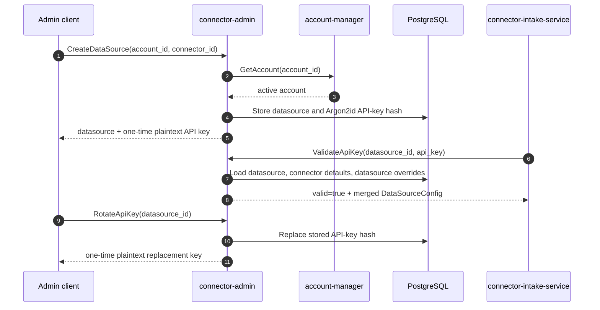
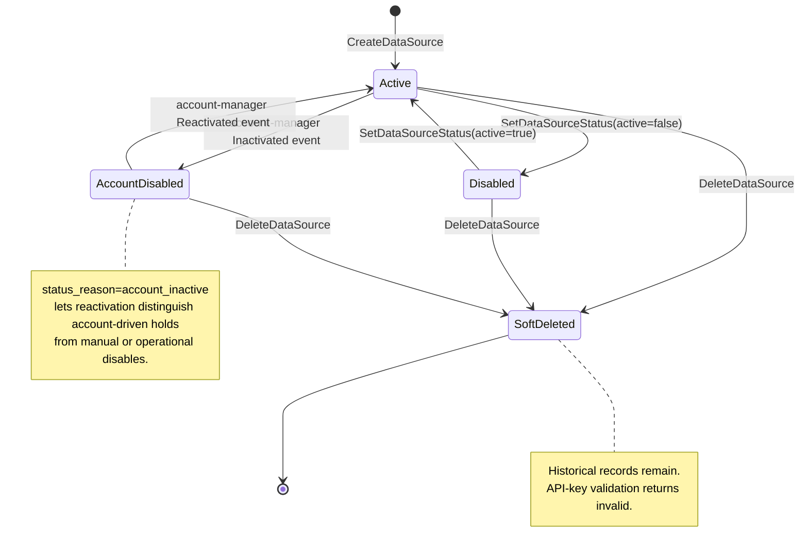
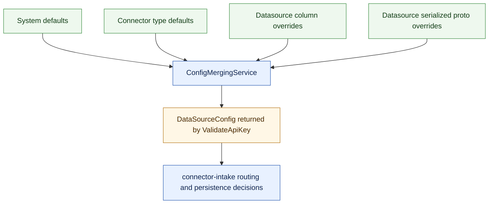
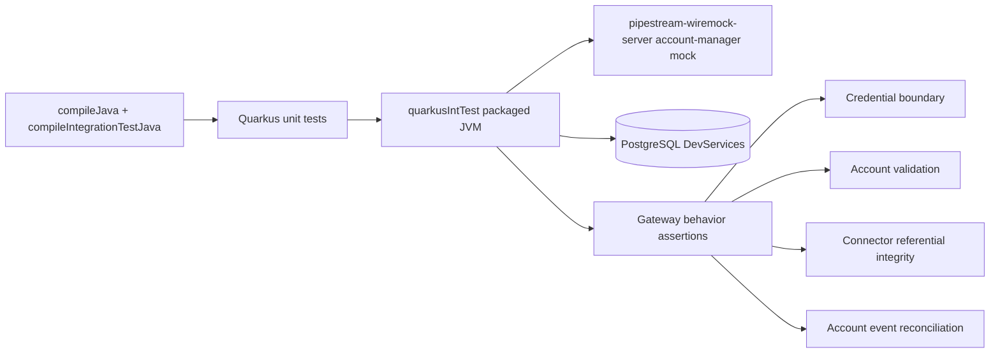

# Connector Admin Production Behavior

Connector Admin is the control-plane gateway for datasource onboarding and API-key validation. It owns the records that allow external connectors to reach the ingestion path, and it is the only service that can create, rotate, disable, or soft-delete datasource credentials.

## System Role

The service has two public gRPC surfaces:

- `DataSourceAdminService` manages datasource lifecycle, API-key validation, API-key rotation, datasource status, connector discovery, and soft-delete.
- `ConnectorRegistrationService` manages connector type registration, connector default metadata, and JSON Schema versions for connector-specific custom configuration.

Generated Mutiny stubs may exist because the protobuf toolchain can produce them, but hand-written production code uses standard grpc-java service implementations and Hibernate ORM/Panache.

## Datasource Contract

Production guarantees:

- Datasource creation requires an account that exists and is active in account-manager.
- Plaintext API keys are returned only by `CreateDataSource` and `RotateApiKey`.
- `GetDataSource` and `ListDataSources` never expose plaintext API keys.
- `ValidateApiKey` accepts only the current key for an active datasource.
- `RotateApiKey` invalidates the previous key immediately.
- `DeleteDataSource` is a soft-delete: the datasource remains auditable, but validation is blocked.

## Status Reconciliation

The account-events consumer runs on a worker thread and inside a transaction. That is important because Kafka consumers do not necessarily run inside a request context; Hibernate ORM access requires a transaction or active request context.

## Configuration Returned To Intake

`ValidateApiKey` is therefore both an authentication check and a configuration handoff. A valid response tells connector-intake that the caller can submit documents for that datasource and provides the configuration needed to process those documents consistently.

## Automated Validation

The packaged tests intentionally avoid repository mocks. They call the service over gRPC, use PostgreSQL for persistence, and use pipestream-wiremock-server only at the account-manager boundary.
