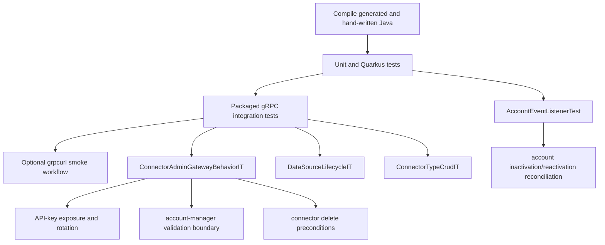
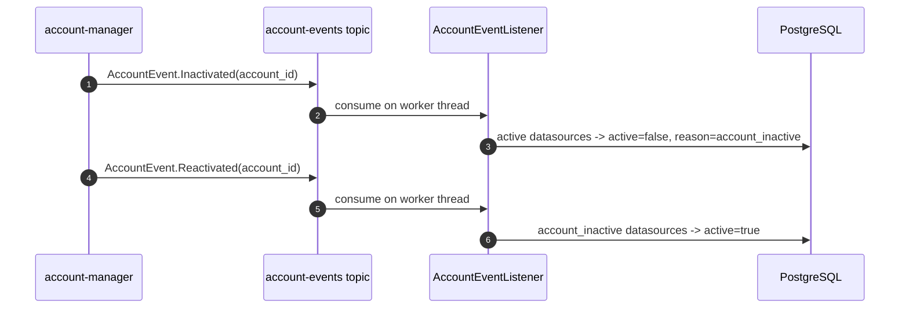

# Connector Admin Test Plan

Connector Admin is the datasource and API-key authority for connector ingestion. The
test plan focuses on proving that only valid, active datasource credentials can reach
the intake path and that connector configuration is returned consistently.



## Test Layers

### Compile

Run:

```bash
./gradlew compileJava compileTestJava compileIntegrationTestJava
```

This proves generated protobuf sources, hand-written services, tests, and integration
tests compile against the current proto branch.

### Unit and Quarkus Tests

Run:

```bash
./gradlew test
```

This layer covers in-JVM behavior such as config merging and account-validation stub
rules. Quarkus DevServices provides PostgreSQL and Kafka when a test needs service
infrastructure.

### Packaged Integration Tests

Run:

```bash
./gradlew quarkusIntTest
```

This is the authoritative automated gateway test. It packages the service, starts the
application as a separate JVM, uses PostgreSQL DevServices for persistence, and uses
`pipestream-wiremock-server` to mock account-manager over gRPC.

Covered gateway behaviors:

- `ConnectorAdminGatewayBehaviorIT` uses standard grpc-java blocking stubs to prove
  the public production contract without CDI, repositories, or reactive test helpers.
- Creating a datasource requires an active account and returns the plaintext API key
  only in the creation response.
- Inactive or missing accounts cannot create datasources.
- Datasource creation fails when the connector type does not exist.
- `GetDataSource` and `ListDataSources` do not expose plaintext API keys.
- `ValidateApiKey` accepts only the active datasource and current key.
- API-key rotation invalidates the old key and returns the new plaintext key once.
- Disable and soft-delete immediately block validation.
- Connector defaults and datasource overrides merge into `DataSourceConfig`.
- Connector/schema CRUD rejects deletes while references exist.

### Account Event Reconciliation

`AccountEventListenerTest` covers the Kafka consumer logic that mirrors account
lifecycle state into datasource access state. It explicitly invokes the listener from
outside the request context to prove that the consumer has the transaction it needs for
Hibernate ORM access.



### Manual grpcurl Workflow

Start the service:

```bash
./gradlew quarkusDev
```

Then follow `docs/RUNNING.md` or run:

```bash
./scripts/upload-document-e2e.sh
```

This verifies the operator workflow with real gRPC calls: list connector types, create
a datasource, validate the key, update metadata, rotate the key, disable/re-enable the
datasource, and perform final validation.

## External Dependencies

- PostgreSQL is real in tests via Quarkus DevServices/Testcontainers.
- Account-manager is mocked only at the service boundary via `pipestream-wiremock-server`.
- Repository methods are not mocked in integration tests.

## Non-Goals

- `DeleteDataSource` is a soft delete in production paths. Hard cleanup is restricted
  to `CleanupTestDataSources` in non-production test contexts.
- Generated Mutiny stubs may exist for compatibility, but hand-written production
  connector-admin code should use standard gRPC and Hibernate ORM Panache.
